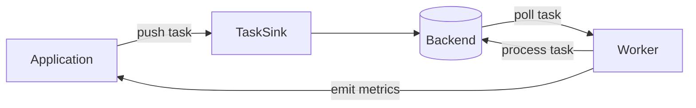
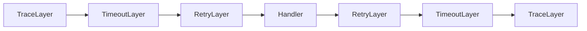

Apalis is designed around a small number of composable abstractions that fit together cleanly. Once you understand the three core layers — [**backends**](/docs/guides/backend/introduction), [**workers**](/docs/guides/workers/introduction), and [**middleware**](/docs/guides/workers/middleware) — every other concept in the documentation is a natural extension of them.

This page gives you a structural map of the whole system before you dive into the details.

---

## The Big Picture


Three things happen in every Apalis deployment:

1. [**Tasks are pushed**](/docs/guides/backend/pushing-tasks) into a backend via `TaskSink` — encoded, wrapped in a `Task` envelope, and written to storage
2. **A worker polls** the backend for tasks, drives them through a [middleware stack](/docs/guides/workers/middleware), and hands them to your handler function
3. **The backend receives heartbeats** from the worker so it can detect stalled workers and requeue their tasks

Everything else — workflows, shared connections, observability, piping — is built on top of these three interactions.

---

## Core Abstractions

### The Task Envelope

Every job in Apalis is wrapped in a [`Task<Args, Context, IdType>`](https://crates.io/crates/apalis-core/1.0.0-rc.7#tasks) before it touches any backend. The envelope carries three things:

- **`Args`** — your job data (an email address, a user ID, a struct)
- **`Context`** — per-task metadata: attempt count, scheduled time, priority, tracing context
- **`IdType`** — a unique identifier for this specific task instance

Your handler function only receives `Args` (and optionally injectable extras like `WorkerContext` or `Data<T>`). The envelope is managed by the runtime — you never construct or inspect it directly unless you need the advanced push methods in `TaskSink`.

---

### The Backend

A backend is anything that can store and deliver tasks. It is defined by two traits:

- **[`Backend`](/docs/guides/backend/introduction)** — the runtime contract: `poll()` for a stream of tasks, `heartbeat()` for liveness signals, `middleware()` for the layer stack
- **[`BackendExt`](/docs/guides/backend/introduction)** — the serialization contract: the `Codec` type, the compact storage representation, and encoded polling
```
Backend
  ├── poll(worker)       →  Stream of Task<Args, Ctx, Id>
  ├── heartbeat(worker)  →  Stream of liveness ticks
  └── middleware()       →  Tower Layer

BackendExt (extends Backend)
  ├── Codec              →  encode Args ↔ Compact
  ├── poll_compact()     →  Stream of Task<Compact, Ctx, Id>
  └── get_queue()        →  Queue identifier
```

The separation between `Backend` and `BackendExt` is intentional. Worker logic depends only on `Backend` — it does not care how tasks are serialized. `TaskSink` and advanced tooling depend on `BackendExt` to access the codec. You can swap serialization formats without changing your handler.

Currently supported backends:

| Backend | Storage | Durability |
|---|---|---|
| `apalis-postgres` | PostgreSQL | ✅ Persistent |
| `apalis-mysql` | MySQL / MariaDB | ✅ Persistent |
| `apalis-sqlite` | SQLite | ✅ Persistent |
| `apalis-redis` | Redis | ✅ Persistent |
| `apalis-cron` | In-memory schedule | ⚡ Ephemeral — use [`pipe_to`](/docs/advanced-concepts/piping-streams) for durability |
| `apalis-amqp` | AMQP broker | ✅ Persistent |
| `apalis-nats` | NATS | ✅ Persistent |

---

### The Worker

A worker drives a backend's task stream through a Tower service stack and into your handler. It is built with [`WorkerBuilder`](https://docs.rs/apalis-core/1.0.0-rc.7/apalis_core/worker/builder/index.html):
```
WorkerBuilder::new("name")
    .backend(B)       →  sets the task source
    .layer(L)         →  wraps the service stack with middleware
    .data(D)          →  injects shared data into the task context
    .build(handler)   →  compiles everything into a Worker
```

Internally, the worker runs a loop:
```
loop {
    task = backend.poll()   // wait for the next task
    result = middleware_stack.call(task)  // run through layers → handler
    backend.ack(task, result)  // mark complete or schedule retry
}
```

The worker also drives `backend.heartbeat()` on a background interval. If the heartbeat stream stops — because the worker panicked or the process died — the backend can detect the absence and requeue any tasks that were in flight.

---

### The Middleware Stack

Middleware in Apalis is plain Tower middleware. Each `.layer()` call wraps the current service, producing a stack where the first layer declared is the outermost. Execution flows inward to the handler and back out:


Because middleware is composable Tower services, anything in the Tower ecosystem — [rate limiting](https://docs.rs/apalis/1.0.0-rc.7/apalis/layers/trait.WorkerBuilderExt.html#tymethod.rate_limit), [circuit breaking](/docs/guides/workers/middleware#circuit-breaker), [load shedding](https://docs.rs/tower/latest/tower/load_shed/index.html), custom instrumentation — works without modification. See [Middleware Order](/docs/guides/workers/order-of-middleware) for guidance on stacking layers correctly.

---

### Codecs

Before a task is written to a backend, its `Args` are serialized into a compact representation by a `Codec`. Before the worker hands a task to your handler, the compact form is deserialized back into `Args`. This happens transparently — your handler always receives the original type.
```
push(email: Email)
    │
    ▼  Codec::encode
Vec<u8>  →  stored in backend
    │
    ▼  Codec::decode  (on poll)
Email  →  handler receives this
```

Apalis ships [`JsonCodec`](https://docs.rs/apalis-codec/latest/apalis_codec/json/struct.JsonCodec.html) (default), `MsgPackCodec`, and `BincodeCodec`. The codec is fixed per backend via `BackendExt::Codec`. See [Codecs](/docs/guides/backend/codecs).

---

## Extended Capabilities

The core three-layer model is extended by a set of optional, composable capabilities:

### Observability — `Expose`

Any backend that implements `ListQueues`, `ListWorkers`, `ListTasks`, `ListAllTasks`, and `Metrics` automatically satisfies the `Expose` trait — and can be registered with `apalis-board` for real-time dashboard visibility. See [Exposing Backends](/docs/guides/backend/maintainance) and [Web UI](/docs/products/web-board).

### Shared Connections — `MakeShared`

When multiple workers share the same data store, `MakeShared` lets them derive independent typed backends from a single underlying connection — avoiding the overhead of one connection per worker. See [Shared Connections](/docs/guides/backend/shared-backend).

### Piping — `PipeExt`

Any `Stream<Item = Result<Args, E>>` can be routed into a backend via [`.pipe_to()`](/docs/advanced-concepts/piping-streams). The resulting `Pipe` implements `Backend`, so the worker sees a unified task stream without knowing the upstream source was a cron schedule, a CDC feed, or a channel. See [Piping Streams](/docs/advanced-concepts/piping-streams).

### Workflows

For multi-step jobs, `apalis_workflow` provides two higher-level backend types that both implement `Backend` and slot into a standard `WorkerBuilder`:

- [**`Workflow`**](/docs/guides/workflows/sequential-workflow) — a linear pipeline of typed async steps connected with combinators (`and_then`, `filter_map`, `fold`, etc.)
- [**`DagFlow`**](/docs/guides/workflows/dag-workflow) — a directed acyclic graph where independent steps run in parallel and dependent steps wait only for their specific inputs

See [Sequential Workflows](/docs/guides/workflows/sequential-workflow) and [DAG Workflows](/docs/guides/workflows/dag-workflow).

---

## Task Lifecycle

Tracing a single task from push to completion:
```
1. Application calls backend.push(email)
      │
      ▼
2. Codec encodes Email → Vec<u8>
      │
      ▼
3. Task<Vec<u8>, Context, Uuid> written to storage
      │
      ▼  (worker polls on interval)
4. Backend::poll yields Task<Email, Context, Uuid>
      │  (codec decodes on the way out)
      ▼
5. Task enters middleware stack
      │  TraceLayer opens span
      │  TimeoutLayer starts deadline
      │  RetryLayer wraps inner call
      ▼
6. Handler receives Email, processes it
      │
      ▼
7. Result (Ok / Err) bubbles back through middleware
      │  RetryLayer: re-submits on Err if attempts remain
      │  TimeoutLayer: cancels if deadline exceeded
      │  TraceLayer: closes span with outcome
      ▼
8. Backend marks task complete (or failed / retrying)
      │
      ▼
9. Heartbeat stream continues — worker signals liveness
```

---

## Crate Structure

Apalis is split into focused crates so you only compile what you need:

| Crate | Role |
|---|---|
| `apalis-core` | `Backend`, `BackendExt`, `TaskSink`, `Worker`, `Task`, codec traits |
| `apalis` | Re-exports core plus built-in layers (tracing, retry, timeout, etc.) |
| `apalis-workflow` | `Workflow` and `DagFlow` backend implementations |
| `apalis-codec` | `JsonCodec`, `MsgPackCodec`, `BincodeCodec` |
| `apalis-board` | Web dashboard API and frontend |
| `apalis-postgres` | PostgreSQL backend |
| `apalis-sqlite` | SQLite backend |
| `apalis-redis` | Redis backend |
| `apalis-cron` | Cron schedule stream source |
| *(others)* | MySQL, AMQP, NATS, RSMQ, PGMQ backends |
