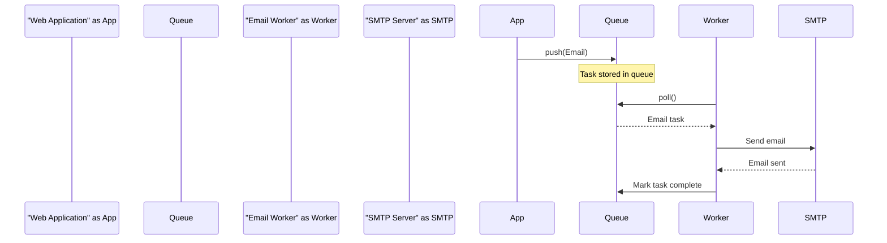
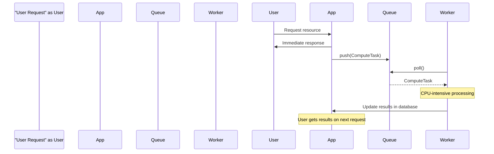
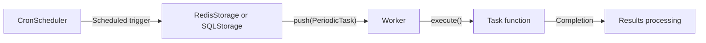
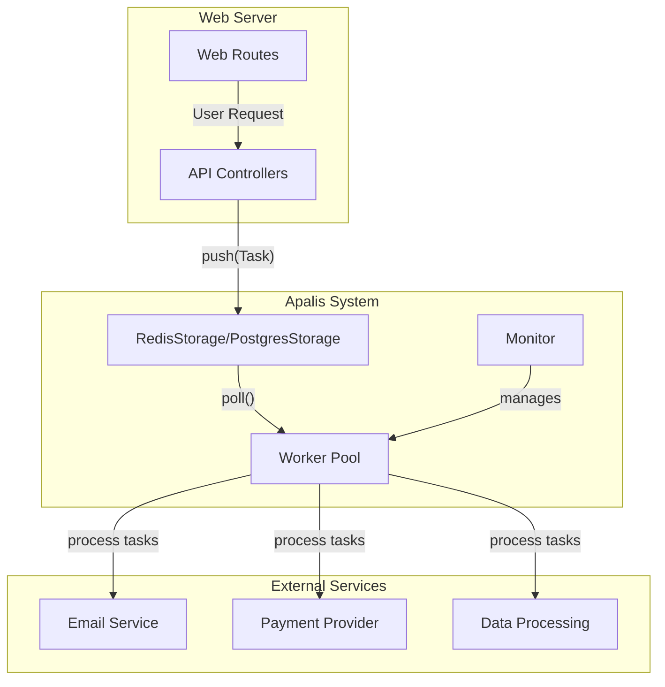
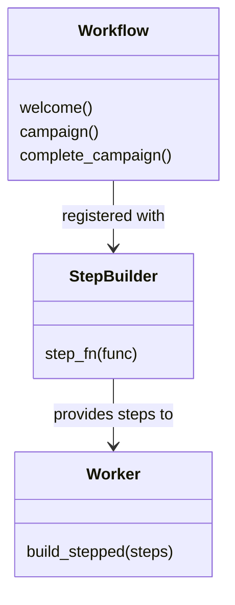
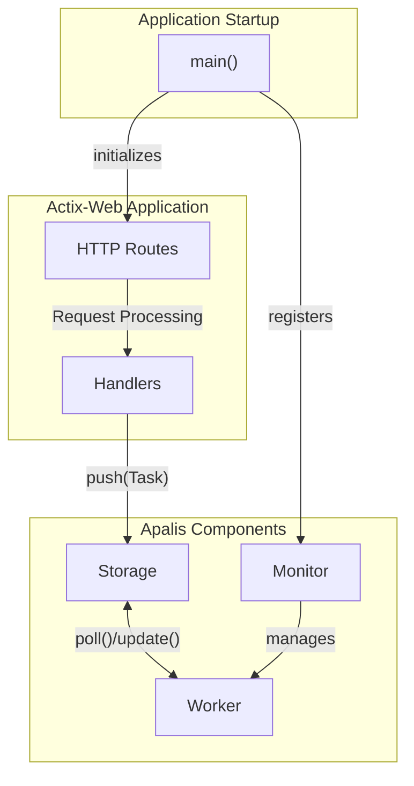
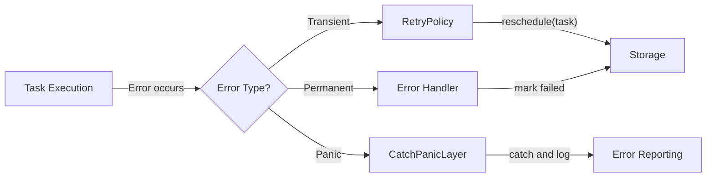
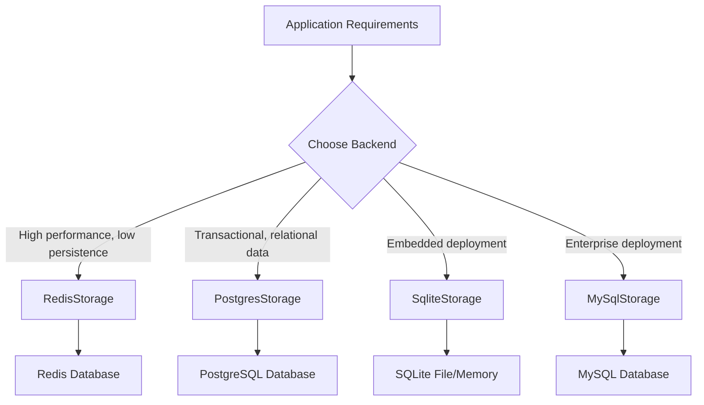

This document outlines the common use cases and application scenarios for apalis. It demonstrates how Apalis can be applied to solve various asynchronous processing needs in real-world applications.

## Common Background Processing Scenarios

Apalis excels in scenarios where work needs to be performed asynchronously, outside the critical path of a user request or system operation. Here are the primary use cases:

### Asynchronous Email Processing

One of the most common use cases for background task processing is sending emails. This prevents user-facing operations from being blocked while waiting for email delivery.



Sources: [examples/redis/src/main.rs:11-22](), [examples/postgres/src/main.rs:12-25](), [examples/basics/src/main.rs:52-88]()

### Heavy Computational Tasks

For CPU-intensive operations that would block the main application thread:



Sources: [README.md:33-46](), [src/lib.rs:18-50]()

### Scheduled and Recurring Tasks

With Apalis' cron integration, you can schedule tasks to run at specific times:



Sources: [README.md:118-153](), [README.md:53]()

## Real-World Implementation Patterns

### Pattern 1: Web Application with Background Processing

This pattern demonstrates integrating Apalis with a web application for handling asynchronous tasks:



This pattern is commonly used for:

- User registration flows with welcome emails
- Order processing in e-commerce
- Report generation
- Data exports

Sources: [examples/redis/src/main.rs:24-75](), [examples/postgres/src/main.rs:27-65]()

### Pattern 2: Stepped Task Processing

Apalis supports complex workflows through stepped task processing:

```
stateDiagram
    [*] --> "TaskCreated"
    "TaskCreated" --> "Step1Processing"
    "Step1Processing" --> "Step2Processing": success
    "Step1Processing" --> "Failed": error
    "Step2Processing" --> "Step3Processing": success
    "Step2Processing" --> "Failed": error
    "Step3Processing" --> "Completed": success
    "Step3Processing" --> "Failed": error
    "Failed" --> [*]
    "Completed" --> [*]
```

In the code, this is implemented using the `StepBuilder` pattern, which allows creating a sequence of processing steps that execute in order:



This pattern is ideal for:

- User onboarding sequences
- Order fulfillment with multiple stages
- Content moderation pipelines
- Multi-stage data processing

Sources: [README.md:118-153]()

## Integration Use Cases

### Web Framework Integration

Apalis integrates with popular Rust web frameworks for seamless background task processing:



Sources: [README.md:197-202]()

### Error Handling and Resilience

Apalis provides robust error handling for production applications:



This pattern allows for:

- Graceful handling of service outages
- Automatic retries for transient failures
- Panic recovery to prevent worker crashes

Sources: [examples/catch-panic/src/main.rs:25-53](), [examples/basics/src/main.rs:101-129]()

## Real-World Projects Using Apalis

Several production applications use Apalis for background processing:

| Project         | Description                         | Use Case                   |
| --------------- | ----------------------------------- | -------------------------- |
| Ryot            | Media & fitness tracking platform   | Background data processing |
| Summarizer      | Podcast summarization               | Audio processing tasks      |
| Universal Inbox | Notification centralization         | Message processing         |
| Hatsu           | ActivityPub bridge for static sites | Content federation         |

Sources: [README.md:204-209]()

## Storage Backends for Different Use Cases

Apalis supports multiple storage backends to fit different operational needs:


