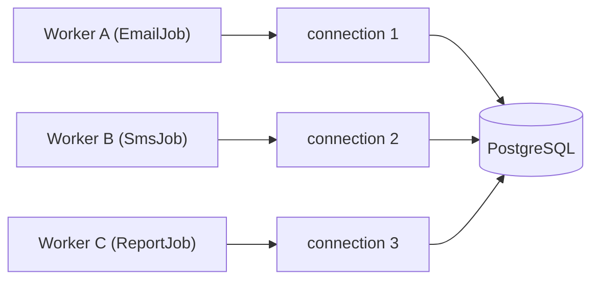
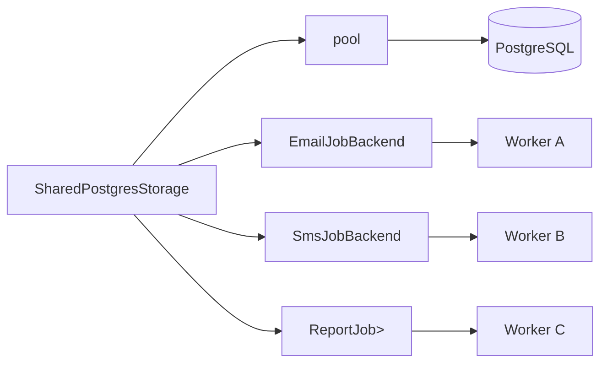

When running multiple workers against the same data store, opening a separate connection per worker is wasteful. Apalis's [`MakeShared`](#the-makeshared-trait) trait solves this by letting you derive multiple typed backend instances from a single underlying connection — so your PostgreSQL pool, Redis client, or custom store is shared rather than duplicated.

> **Rule of thumb:** if you have more than one job type backed by the same database or broker, use a shared connection.

---

## The `MakeShared` Trait
```rust
pub trait MakeShared<Args> {
    /// The concrete backend type returned for workers to consume.
    type Backend;

    /// Configuration options applied when creating the shared instance.
    /// Falls back to `Default` when calling `make_shared()`.
    type Config;

    /// The error returned if a shared instance cannot be created —
    /// for example, if the underlying connection is no longer healthy.
    type MakeError;

    /// Create a shared backend instance using default configuration.
    fn make_shared(&mut self) -> Result<Self::Backend, Self::MakeError>
    where
        Self::Config: Default,
    {
        self.make_shared_with_config(Default::default())
    }

    /// Create a shared backend instance with explicit configuration.
    fn make_shared_with_config(
        &mut self,
        config: Self::Config,
    ) -> Result<Self::Backend, Self::MakeError>;
}
```

### Associated Types

| Type | Purpose |
|---|---|
| `Backend` | The typed backend instance handed to a [`WorkerBuilder`] |
| `Config` | Optional configuration applied per-instance (e.g. queue name, poll interval) |
| `MakeError` | Returned if the shared instance cannot be constructed |

`make_shared()` is a convenience wrapper around `make_shared_with_config` that uses `Config::default()`. Call `make_shared_with_config` directly when you need per-worker tuning.

---

## Why Share Connections?

Without shared connections, each worker independently manages its own connection to the backend:


With `MakeShared`, a single connection (or pool) is distributed across all workers:


This means:
- **Fewer open connections** to your data store
- **Lower memory overhead** per worker
- **Consistent configuration** — one place to set pool size, timeouts, and credentials

---

## Postgres Example

The following example runs two workers — one processing `HashMap` jobs, one processing `i32` jobs — over a single shared `PgPool`.
```rust fileName="main.rs" mode="compile"
use std::{collections::HashMap, time::Duration};

use apalis::prelude::*;
use apalis_postgres::{shared::SharedPostgresStorage, *};
use futures::stream;

#[tokio::main]
async fn main() {
    // 1. Create the underlying connection pool once.
    let pool = PgPool::connect(&std::env::var("DATABASE_URL").unwrap())
        .await
        .unwrap();

    // 2. Run schema migrations if this is first use.
    PostgresStorage::setup(&pool).await.unwrap();

    // 3. Wrap the pool in a SharedPostgresStorage — the single source of truth.
    let mut store = SharedPostgresStorage::new(pool);

    // 4. Derive a typed backend for each job type.
    //    Each call to make_shared() returns an independent Backend
    //    that shares the underlying pool.
    let mut map_store = store.make_shared().unwrap();
    let mut int_store = store.make_shared().unwrap();

    // 5. Enqueue some tasks.
    map_store
        .push_stream(&mut stream::iter(vec![HashMap::<String, String>::new()]))
        .await
        .unwrap();
    int_store.push(99).await.unwrap();

    // 6. A generic handler — each worker uses the same function signature.
    async fn send_reminder<T, I>(
        _: T,
        _task_id: TaskId<I>,
        wrk: WorkerContext,
    ) -> Result<(), BoxDynError> {
        tokio::time::sleep(Duration::from_secs(2)).await;
        wrk.stop().unwrap();
        Ok(())
    }

    // 7. Build workers from the derived backends.
    let int_worker = WorkerBuilder::new("worker-int")
        .backend(int_store)
        .build(send_reminder);

    let map_worker = WorkerBuilder::new("worker-map")
        .backend(map_store)
        .build(send_reminder);

    // 8. Run both workers concurrently.
    tokio::try_join!(int_worker.run(), map_worker.run()).unwrap();
}
```

### What's happening step by step

1. A single `PgPool` is created — this is the only point of contact with the database.
2. `SharedPostgresStorage::new(pool)` wraps it in the `MakeShared`-capable store type.
3. Each `make_shared()` call produces an independent `Backend` parameterised over a different `Args` type — `HashMap<String, String>` and `i32` here.
4. Tasks are pushed via [`TaskSink`](/docs/backend/pushing-tasks) as normal; shared backends implement the same push interface.
5. Two workers are built and run concurrently with `tokio::try_join!`. If either worker errors, both are cancelled.

---

## Using Custom Configuration

When you need per-backend tuning — such as a different poll interval or queue name — use `make_shared_with_config`:
```rust
let config = PostgresConfig {
    poll_interval: Duration::from_millis(500),
    ..Default::default()
};

let mut fast_store = store.make_shared_with_config(config).unwrap();
```

The available fields in `Config` depend on the backend implementation. Refer to the backend-specific documentation for the full list of options.

---

## Implementing `MakeShared` for a Custom Backend

If you are building your own backend, implement `MakeShared` by cloning or reference-counting the underlying connection:
```rust
use apalis::prelude::MakeShared;

struct MySharedBackend<Args> {
    pool: Arc<MyConnectionPool>,
    _phantom: PhantomData<Args>,
}

impl<Args> MakeShared<Args> for MySharedBackend<Args> {
    type Backend = MyBackend<Args>;
    type Config  = MyBackendConfig;
    type MakeError = MyError;

    fn make_shared_with_config(
        &mut self,
        config: Self::Config,
    ) -> Result<Self::Backend, Self::MakeError> {
        Ok(MyBackend::new(Arc::clone(&self.pool), config))
    }
}
```

The key pattern: the shared wrapper holds an `Arc` (or equivalent) to the resource, and each `make_shared_with_config` call clones only the reference — not the connection itself.

---

## Summary

| Method | When to use |
|---|---|
| `make_shared()` | Multiple workers, default configuration |
| `make_shared_with_config(cfg)` | Multiple workers, per-worker tuning needed |

`MakeShared` is the idiomatic Apalis pattern for running several job queues against the same data store without multiplying connection overhead. Pair it with `tokio::try_join!` to run all workers concurrently from a single entry point.

